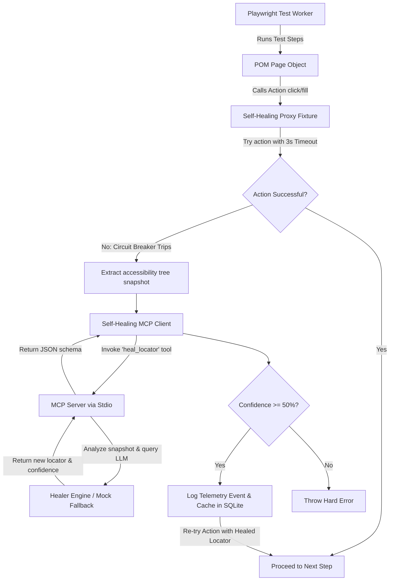

# Enterprise-Grade Self-Healing Playwright Framework: AI-Augmented Locators via MCP

This repository contains an enterprise-grade TypeScript/Playwright automation framework that leverages the Model Context Protocol (MCP) to achieve locator self-healing. By decoupling standard retry/auto-wait logic from intelligent healing algorithms, the framework detects locator failures in real-time, extracts optimized DOM accessibility snapshots, and utilizes a Model Context Protocol server to synthesize resilient fallback locators.

---

## 🏛️ Architectural Overview

The framework acts as a proxy between the static Page Object Model (POM) definitions and Playwright's execution engine. The architecture consists of the following key pillars:



1. **Proxy-Based Interception (`src/fixtures/selfHealingFixture.ts`)**
   Wraps the Playwright `Page` and `Locator` instances inside JavaScript Proxies. This captures actions (e.g. `click`, `fill`) and applies a **3-second fast-timeout (circuit breaker)**. If it fails, healing commences dynamically without tearing down the browser context.

2. **Model Context Protocol Layer (`src/core/mcpServer.ts` & `src/core/mcpClient.ts`)**
   Uses the official `@modelcontextprotocol/sdk` to establish a client-server architecture communicating via stdin/stdout. The MCP server registers a `heal_locator` tool that receives the error context, URL, and accessibility tree to produce resilient locators.

3. **Healer Engine with Offline Mock (`src/core/healer.ts`)**
   Contains the LLM prompt-engineering logic. If `GEMINI_API_KEY` is configured in the environment, it uses the Gemini API. Otherwise, it gracefully falls back to an offline mock database covering the SauceDemo application to guarantee flawless demo execution.

4. **Lock-Safe SQLite Caching (`src/core/cache.ts`)**
   Uses SQLite in Write-Ahead Logging (WAL) mode. When a locator is healed, it is cached in `healing-cache.db`. Subsequent worker threads check the cache first, bypassing LLM latency (resolving in <1 second) and preventing file corruption during parallel execution.

5. **Reporting & PR Generation (`src/core/reporter.ts` & `src/scripts/prGenerator.ts`)**
   Outputs a beautiful, visual HTML dashboard (`healing-dashboard.html`) and an automated patch script that resolves stale locators in your source files in-place and details the git workflow to push a hotfix PR.

---

## 📂 Folder Structure

```
├── healing-cache.db          # Shared SQLite database (cache & telemetry)
├── healing-dashboard.html    # Premium visual dashboard report
├── healing-report.json       # Structured telemetry run output
├── package.json
├── playwright.config.ts      # Configures parallel execution & custom reporter
├── tsconfig.json
└── src
    ├── core
    │   ├── cache.ts          # Cache manager (SQLite)
    │   ├── healer.ts         # Healer engine (Gemini & Mock)
    │   ├── mcpClient.ts      # MCP client spawned in test workers
    │   ├── mcpServer.ts      # Local MCP server via stdio
    │   ├── reporter.ts       # Custom Playwright report compiler
    │   └── telemetry.ts      # SQLite-based telemetry logging
    ├── fixtures
    │   └── selfHealingFixture.ts # Page and Locator proxy wrappers
    ├── pages
    │   ├── LoginPage.ts      # LoginPage POM
    │   └── InventoryPage.ts  # InventoryPage POM
    ├── scripts
    │   └── prGenerator.ts    # Auto-patch & PR generator
    └── tests
        └── saucedemo.spec.ts # Test suite
```

---

## ⚡ Setup & Installation

1. Install dependencies:
   ```bash
   npm install
   ```

2. (Optional) Create a `.env` file in the root to enable live Gemini healing:
   ```env
   GEMINI_API_KEY="your-gemini-api-key"
   ```
   *Note: If no API key is specified, the framework uses the offline mock database for SauceDemo elements.*

---

## 🚀 Running the Tests

Execute the Playwright test suite:
```bash
npm run test
```

### What happens during execution:
1. **`Successful Login and Cart Flow (Normal)`**: Runs normally with correct selectors to verify basic application sanity.
2. **`Self-Healing Flow (Corrupted Locators)`**: Runs with 9 corrupted/stale selectors. For each selector, the circuit breaker triggers after 3 seconds, queries the MCP Server, heals the locator, saves it in SQLite, and completes the flow successfully.
3. **`Cached Healing Verification (Second Run Performance)`**: Runs the exact same corrupted selectors. Since they are cached, it resolves them instantly under 1 second without querying the AI or waiting for timeouts, proving the effectiveness of the WAL SQLite cache.

---

## 📈 Dashboard & PR Generation

### 1. View the Telemetry Dashboard
After the tests complete, open the visual HTML dashboard in your browser:
```bash
open healing-dashboard.html
```

### 2. Auto-Patch Source Code & Generate PR
Run the PR generation script to parse telemetry, locate the stale selectors in your source code, fix them in-place, and view Git push branch recommendations:
```bash
npm run generate-pr
```
This script updates the stale strings directly in `src/tests/saucedemo.spec.ts` to show how self-healing updates loop back into standard source control, avoiding technical debt.
